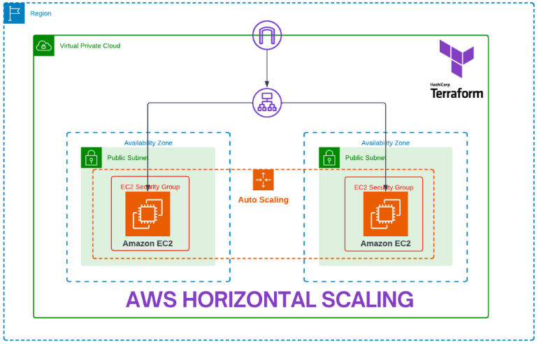

Create an Auto Scaling Group on AWS with Terraform

An Auto Scaling Group is a fundamental component of AWS that allows you to automatically adjust the number of instances based on demand. It helps maintain application availability, distribute traffic evenly, and optimize resource utilization.

